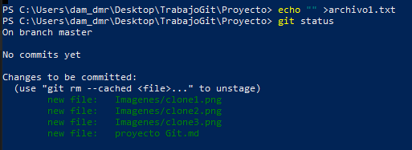
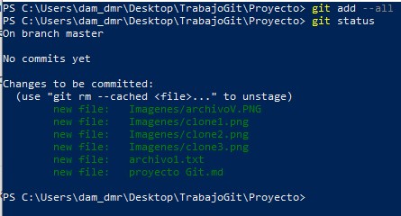
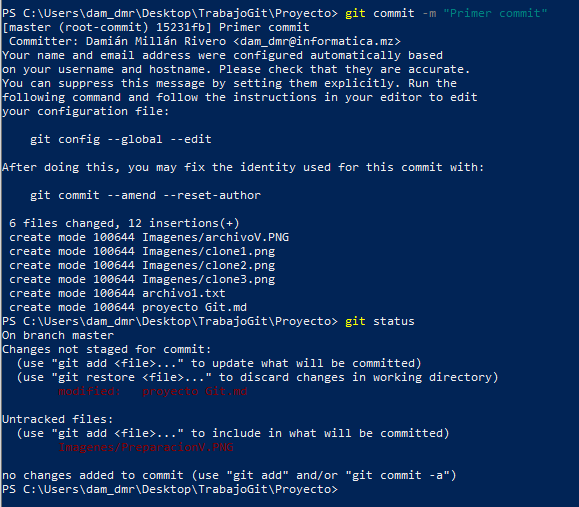

##### Clonamos el proyecto.
!
##### inicializamos el directorio.

##### añadimos los ficheros y preparamos.

##### 3. Cread un primer archivo "archivo1.txt". 4. Visuaalizad el estado del proyecto

##### 5. Pasad el archivo del espacio de trabajo a la zona de preparación.
##### 6. Visualizad de nuevo el estado del proyecto.

##### 7. Realizad el primer commit y visualizad de nuevo el estado del proyecto.

